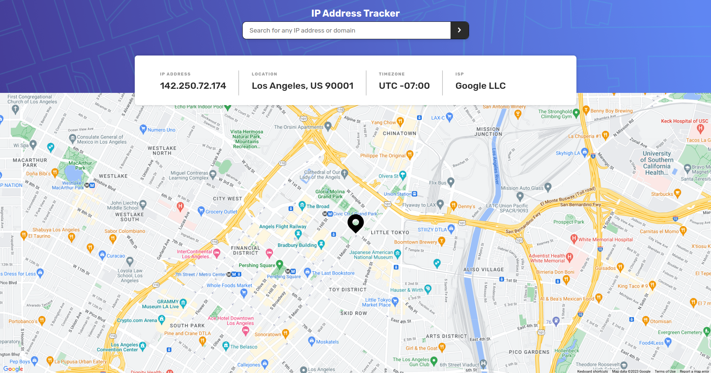

# Frontend Mentor - IP address tracker solution

This is a solution to the [IP address tracker challenge on Frontend Mentor](https://www.frontendmentor.io/challenges/ip-address-tracker-I8-0yYAH0). Frontend Mentor challenges help you improve your coding skills by building realistic projects.

## Table of contents

- [Overview](#overview)
  - [The challenge](#the-challenge)
  - [Screenshot](#screenshot)
  - [Links](#links)
- [My process](#my-process)
  - [Built with](#built-with)
  - [What I learned](#what-i-learned)
- [Author](#author)

## Overview

### The challenge

Users should be able to:

- View the optimal layout for each page depending on their device's screen size
- See hover states for all interactive elements on the page
- See their own IP address on the map on the initial page load
- Search for any IP addresses or domains and see the key information and location

### Screenshot



I tried to make the design as close as possible to the original design, I think I did a good job, but I think I could have done better with things like sizing and spacing.

### Links

- Live Site URL: [Link here](https://ip-address-tracker-psi-ochre.vercel.app/)

## My process

### Built with

- Semantic HTML5 markup
- Flexbox
- TypeScript
- Mobile-first workflow
- [React](https://reactjs.org/) - JS library
- [Google Maps API](https://developers.google.com/maps/documentation/javascript/overview) - For maps
- [IP Geolocation API](https://geo.ipify.org/) - For IP geolocation
- [Styled Components](https://styled-components.com/) - For styles
- [Axios](https://axios-http.com/) - For HTTP requests
- [Tanstack Query](https://tanstack.com/query/v4/docs/react/overview) - For state management

### What I learned

I learned how to implement Google Maps API in React, although I had to use a library to do so. Maybe I'll try to do it without a library in the future, but for now, I'm satisfied with the result.

I challenge myself to use a context for managing the state of the application. I used Tanstack Query for this purpose, the context main purpose is to handle the search and the data fetching. So the components that need the data can use the context to get it. Looking back, I think I could just made a custom hook for this purpose, but I wanted to try something new.

```ts
const IPTrackerProvider = ({ children }: PropsWithChildren) => {
  const { mutate, data, isLoading, isError } = useMutation({
    mutationFn: getIPInfo,
  });

  const {
    data: userIPData,
    isLoading: isUserDataLoading,
    isError: isUserError,
  } = useQuery({
    queryKey: ['userIP'],
    queryFn: getUserIP,
  });

  const handleSearch = (form: string) => mutate(form);

  const value = useMemo(
    () => ({
      handleSearch,
      data: data || userIPData,
      isLoading: isLoading || isUserDataLoading,
      isError: isError || isUserError,
    }),
    [data, userIPData],
  );

  return (
    <IPTrackerContext.Provider value={value}>
      {children}
    </IPTrackerContext.Provider>
  );
};
```

Since the api that I used needs a domain or an IP address to get the data, I had to validate the input to know if it's a domain or an IP address. I used a regex to do this.

```ts
const validateParams = (data: string) => {
  const pattern = /\b(?:\d{1,3}\.){3}\d{1,3}\b/g;

  if (pattern.test(data)) {
    return {
      ipAddress: data,
    };
  }

  return {
    domain: data,
  };
};
```

## Author

- Frontend Mentor - [@MiGIGiM](https://www.frontendmentor.io/profile/MiGIGiM)
